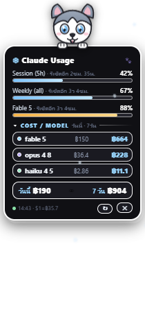
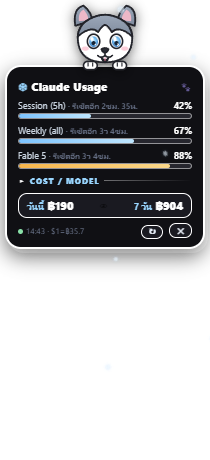

# 🐺 Claude Usage Widget

A tiny, cartoon-styled floating desktop widget (Windows & macOS / Electron) that shows your **Claude plan usage** and **cost per model** — guarded by a cute Siberian Husky. วิดเจ็ตลอยบนเดสก์ท็อปแสดงการใช้งาน Claude แบบเรียลไทม์ พร้อมน้องหมาไซบีเรียนฮัสกี้เฝ้าการ์ดให้

<p align="center">
  
  
</p>

## Features

- **Plan limits** — Session (5h) / Weekly / per-model utilization bars with reset countdown, from the same `api.anthropic.com/api/oauth/usage` endpoint that Claude Code's `/usage` command uses
- **Cost per model** — computed locally from `~/.claude/projects/**/*.jsonl` (ccusage-style, deduped per streaming request), shown for today and the last 7 days
- **Thai Baht** — live USD→THB rate (open.er-api.com, cached 12h, fallback ฿36)
- **Privacy toggle** — click the totals row (👁) to mask all money as `฿•••`
- **Collapsible** — click `▾ Cost / Model` to shrink the card
- Transparent, frameless, always-on-top (screen-saver z-level with auto re-assert), draggable, remembers its position, tray menu, auto-refresh every 5 minutes
- OAuth token auto-refresh: if the Claude Code access token in `~/.claude/.credentials.json` has expired, the widget refreshes it and writes the rotated tokens back

Inspired by [PanithanNanti/claude-usage-widget](https://github.com/PanithanNanti/claude-usage-widget) (macOS / Übersicht) — rebuilt for Windows with Electron.

## Requirements

- Windows 10/11 or macOS 12+ (Intel or Apple Silicon)
- [Claude Code](https://claude.com/claude-code) installed and logged in (the widget reads its credentials and local usage logs)
- Node.js (only for building; the packaged app runs standalone)

## Run from source

Windows (PowerShell):

```powershell
npm install
npm start
```

macOS:

```bash
npm install
npm start
```

## Build a portable app

Windows:

```powershell
npm run build:win
```

Then launch `dist\ClaudeUsageWidget-win32-x64\ClaudeUsageWidget.exe`. To start with Windows, drop a shortcut to it into `shell:startup`.

macOS (.app only):

```bash
# one-time: generate build/icon.icns from build/icon.png
./build/make-icns.sh
npm run build:mac
```

This produces `dist/ClaudeUsageWidget-darwin-universal/ClaudeUsageWidget.app`. Drag it into `/Applications`, then launch it.

macOS (.dmg installer):

```bash
# one-time: generate build/icon.icns from build/icon.png
./build/make-icns.sh
npm run dist:mac
```

This produces `dist/ClaudeUsageWidget-<version>-universal.dmg` (built with [electron-builder](https://www.electron.build/)) — a drag-to-Applications installer disk image. Both build commands must be run **on a Mac** (dmg creation relies on macOS's `hdiutil`, and packaging isn't cross-compiled from Windows/Linux).

Since neither build is signed/notarized, the first time you open the app you'll likely need to right-click → Open (or allow it in System Settings → Privacy & Security → "Open Anyway").

To start automatically at login on macOS, either:
- System Settings → General → Login Items → add `ClaudeUsageWidget.app`, or
- copy `build/com.claude.usagewidget.plist` to `~/Library/LaunchAgents/`, edit the `ProgramArguments` path to match where you installed the app, then run `launchctl load ~/Library/LaunchAgents/com.claude.usagewidget.plist`.

Running from source without building, `start-widget.sh` launches the widget silently (equivalent to `start-widget.vbs` on Windows).

## Notes

- Cost figures are **API-equivalent value** (tokens × published API pricing). On a subscription plan (Pro/Max) this is the value consumed, not an actual bill.
- Pricing table lives in [usage.js](usage.js) — update it when model prices change.
- No data leaves your machine except the calls to Anthropic (usage API) and open.er-api.com (exchange rate).
